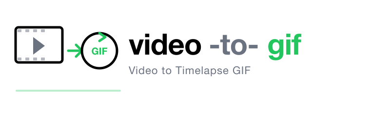

<p align="center"></p>

# video-to-gif

A Node.js command-line tool that converts MP4 or MOV videos to high-quality timelapse GIFs using FFmpeg.

[](https://github.com/luongnv89/video-to-gif/actions/workflows/ci.yml)
[](https://opensource.org/licenses/MIT)
[](https://nodejs.org)

## Example Output


## Features

- **Timelapse Mode**: Converts entire videos into short GIFs (max 5 seconds) by sampling frames evenly across the video
- **High-Quality Output**: Uses FFmpeg's palette-based encoding for superior GIF quality
- **Customizable**: Control duration, frame rate, resolution, quality, and more
- **Progress Bar**: Visual feedback during conversion
- **Cross-Platform**: Works on macOS, Linux, and Windows

## Prerequisites

- **Node.js** >= 20.0.0
- **FFmpeg** must be installed and available in your PATH

### Installing FFmpeg

**macOS (Homebrew):**
```bash
brew install ffmpeg
```

**Ubuntu/Debian:**
```bash
sudo apt update && sudo apt install ffmpeg
```

**Windows (Chocolatey):**
```bash
choco install ffmpeg
```

## Installation

### From npm (recommended)

```bash
npm install -g video-to-gif
```

### From source

```bash
git clone https://github.com/luongnv89/video-to-gif.git
cd video-to-gif
npm install
npm link  # Makes 'video2gif' command available globally
```

## Usage

### Basic Usage

```bash
video2gif video.mp4
```

This creates a 5-second timelapse GIF of the entire video at the same location with the same base name.

### With Options

```bash
video2gif video.mp4 -d 3 -r 15 -w 480 -q high -y
```

Creates a 3-second GIF at 15 FPS, 480px wide, high quality, overwriting if exists.

### Running from Source

```bash
node src/video2gif.js video.mp4
```

## Options

| Option | Short | Description | Default |
|--------|-------|-------------|---------|
| `--output-dir <path>` | `-o` | Output directory | Same as input |
| `--name <filename>` | `-n` | Output filename (without extension) | Same as input |
| `--start <time>` | `-s` | Start sampling from timestamp | `0` |
| `--duration <seconds>` | `-d` | Output GIF duration (max 5) | `5` |
| `--fps <number>` | `-r` | Frame rate (1-60) | `10` |
| `--width <pixels>` | `-w` | Output width (height auto-calculated) | Original |
| `--quality <level>` | `-q` | Quality preset: `low`, `medium`, `high` | `high` |
| `--overwrite` | `-y` | Overwrite existing output file | `false` |
| `--version` | `-V` | Show version number | |
| `--help` | `-h` | Show help | |

### Time Formats

The `--start` option accepts multiple formats:
- Seconds: `30`
- Minutes:Seconds: `1:30`
- Hours:Minutes:Seconds: `0:01:30`

### Quality Presets

| Preset | Description |
|--------|-------------|
| `low` | Fastest, smallest file, may have color banding |
| `medium` | Balanced quality and file size |
| `high` | Best quality, larger file, advanced dithering |

## How It Works

This tool creates a **timelapse GIF** that shows the entire video's progression from start to end, compressed into a short GIF (max 5 seconds).

**Example**: A 60-second video converted with default settings (5s, 10 FPS):
- Total frames in GIF: 50 frames
- Samples 1 frame every 1.2 seconds from the video
- Result: 5-second GIF showing the full video as a fast-forward

## Examples

### Create timelapse of entire video
```bash
video2gif recording.mp4
```

### Create shorter, smoother GIF with smaller dimensions
```bash
video2gif recording.mp4 -d 3 -r 15 -w 480
```

### Start from a specific timestamp
```bash
video2gif recording.mp4 -s 30
# or
video2gif recording.mp4 -s 0:30
```

### Custom output location and name
```bash
video2gif recording.mp4 -o ./gifs -n my-timelapse -y
```

## Development

### Setup

```bash
git clone https://github.com/luongnv89/video-to-gif.git
cd video-to-gif
npm install
```

### Commands

```bash
npm test              # Run tests
npm run test:coverage # Run tests with coverage
npm run lint          # Run ESLint
npm run lint:fix      # Fix ESLint issues
npm run format        # Format code with Prettier
npm run format:check  # Check code formatting
```

### Project Structure

```
video-to-gif/
├── bin/              # CLI entry point
├── src/              # Source code
├── tests/            # Test files
├── docs/             # Documentation
├── .github/          # GitHub Actions workflows
└── package.json
```

## Contributing

Contributions are welcome! Please feel free to submit a Pull Request.

1. Fork the repository
2. Create your feature branch (`git checkout -b feature/amazing-feature`)
3. Commit your changes (`git commit -m 'Add some amazing feature'`)
4. Push to the branch (`git push origin feature/amazing-feature`)
5. Open a Pull Request

## License

This project is licensed under the MIT License - see the [LICENSE](LICENSE) file for details.

## Acknowledgments

- [FFmpeg](https://ffmpeg.org/) - The backbone of video processing
- [fluent-ffmpeg](https://github.com/fluent-ffmpeg/node-fluent-ffmpeg) - Node.js FFmpeg wrapper
- [Commander.js](https://github.com/tj/commander.js/) - CLI framework
- [cli-progress](https://github.com/npkgz/cli-progress) - Progress bar library
